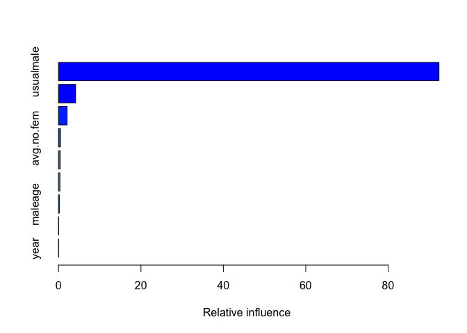

horse\_group\_change
================
Ilya
12/17/2019

\#\#\#\#\#install packages

    ## Loading required package: lattice

    ## Loading required package: ggplot2

    ## 
    ## Attaching package: 'dplyr'

    ## The following objects are masked from 'package:stats':
    ## 
    ##     filter, lag

    ## The following objects are masked from 'package:base':
    ## 
    ##     intersect, setdiff, setequal, union

    ## Loaded gbm 2.1.5

    ## Loading required package: gplots

    ## 
    ## Attaching package: 'gplots'

    ## The following object is masked from 'package:stats':
    ## 
    ##     lowess

\#\#read in
data

``` r
H = read.csv("mare cort and grp change data for mb comparison 20191007_correct.csv")

save(H, file = "H.Rdata")
```

\#\#remove fields we won’t be using for now

``` r
load("H.Rdata")
rm = c("mare",
       "mare_year",
       "tot.gp.changes",
       "tot.trt.cat",
       "tot.trt.cat.2")
keep = setdiff(names(H), rm)
H = H[,keep]
save(H, file = "H.Rdata")
```

\#\#one-hot encode categorical fields

``` r
load("H.Rdata")
df = H
dmy <- dummyVars(" ~ .", data = df,fullRank = T, sep=".")
df_transformed <- data.frame(predict(dmy, newdata = df))
save(df_transformed, file = "df_transformed.Rdata")
```

\#\#Bootstrap permutations for null distribution of AUC –
presence/absence

``` r
p = 50#number of bootstrap permutations
shrinkage = 0.0001
n.trees = 10000
interaction.depth = 3
save(p, file = "p.Rdata")
load("df_transformed.Rdata")
#Start the clock
ptm<-proc.time()

permutedAUC<-c()
best.iter2.list = c()
i=1
bootstrap_runs = p
while (i <= bootstrap_runs) {
  # for permutation loop
  ## random permutation of Label
  randomLabel<-sample(df$ch.binary)

  pan2<-cbind(randomLabel,df)
  #remove previous label
  rm = "ch.binary"
  keep = setdiff(names(pan2),rm)
  pan2 = pan2[,keep]

  pan2[,1]<-sapply(pan2[,1],as.character)

  ## create training and test sets
  intrain2<-createDataPartition(y=pan2$randomLabel,
                                p=0.8,
                                list=FALSE)

  test2<-pan2[-intrain2,]
  training2<-pan2[intrain2,]

  check<-1-is.na(training2)*1
  checksum<-apply(check,2,sum)
  n_cols= dim(training2)[2]

  
  if(length(which(checksum>=2))==n_cols){#this makes sure we don't get any columns with all zeros. Should be == to the number of columns

    ## random permutation of Labels ~ traits
    y_col = 1
    x_col = c(2:dim(pan2)[2])

    model<-as.formula(paste(colnames(pan2)[y_col], "~",
                            paste(colnames(pan2)[x_col],collapse = "+"),
                            sep = ""))

     gbm2<- gbm(model,
                   data=training2,
                   distribution="bernoulli",
                   n.trees=n.trees,
                   shrinkage=shrinkage,
                   interaction.depth=interaction.depth,
                   bag.fraction=0.50,
                   train.fraction=1,
                   n.minobsinnode=3,
                   cv.folds=10,
                   keep.data=TRUE)

    #check performance using 5-fold cross-validation
    best.iter2 <- gbm.perf(gbm2,method="cv",plot.it=FALSE) #OOB method under predicts
    #   batsum2<-summary.gbm(gbm2,n.trees=best.iter,method=relative.influence,plotit=FALSE)
    best.iter2.list = c(best.iter2.list, best.iter2)
    ## LABEL
    ## predictions on the TRAINING SET
    output2<-predict(gbm2, newdata=training2, n.trees=best.iter2, type="response")
    output2<-cbind(output2,as.numeric(training2$randomLabel))

    # # training AUC for Bernoulli distributed responses
    auc2=colAUC(output2[,1],output2[,2])

    # Predictions on the TEST set
    output.test2<-predict(gbm2, newdata=test2, n.trees=best.iter2, type="response")
    output.test2<-cbind(output.test2,as.numeric(test2$randomLabel))
    # colnames(output.test2)<-c("output","label")
    # output.test2<-output.test2[order(-output.test2[,1]),]
    # plot(output.test)

    ## test AUC for Bernoulli distributed responses
    auctest2=colAUC(output.test2[,1],output.test2[,2])

    permutedAUC[i]<-auctest2
    print(auctest2)
    i=i+1
    print(i)#check where we are in bootstrap
  } else i=i
}
```

    ##              [,1]
    ## 0 vs. 1 0.6666667
    ## [1] 2
    ##           [,1]
    ## 0 vs. 1 0.5625
    ## [1] 3
    ##              [,1]
    ## 0 vs. 1 0.7916667
    ## [1] 4
    ##              [,1]
    ## 0 vs. 1 0.5833333
    ## [1] 5
    ##         [,1]
    ## 0 vs. 1 0.75
    ## [1] 6
    ##              [,1]
    ## 0 vs. 1 0.7083333
    ## [1] 7
    ##              [,1]
    ## 0 vs. 1 0.6041667
    ## [1] 8
    ##           [,1]
    ## 0 vs. 1 0.5625
    ## [1] 9
    ##          [,1]
    ## 0 vs. 1 0.625
    ## [1] 10
    ##          [,1]
    ## 0 vs. 1 0.875
    ## [1] 11
    ##         [,1]
    ## 0 vs. 1 0.75
    ## [1] 12
    ##         [,1]
    ## 0 vs. 1 0.75
    ## [1] 13
    ##         [,1]
    ## 0 vs. 1 0.75
    ## [1] 14
    ##              [,1]
    ## 0 vs. 1 0.6666667
    ## [1] 15
    ##              [,1]
    ## 0 vs. 1 0.6666667
    ## [1] 16
    ##              [,1]
    ## 0 vs. 1 0.5416667
    ## [1] 17
    ##         [,1]
    ## 0 vs. 1 0.75
    ## [1] 18
    ##           [,1]
    ## 0 vs. 1 0.5625
    ## [1] 19
    ##              [,1]
    ## 0 vs. 1 0.6666667
    ## [1] 20
    ##           [,1]
    ## 0 vs. 1 0.8125
    ## [1] 21
    ##              [,1]
    ## 0 vs. 1 0.5416667
    ## [1] 22
    ##              [,1]
    ## 0 vs. 1 0.7916667
    ## [1] 23
    ##              [,1]
    ## 0 vs. 1 0.5416667
    ## [1] 24
    ##         [,1]
    ## 0 vs. 1 0.75
    ## [1] 25
    ##         [,1]
    ## 0 vs. 1  0.5
    ## [1] 26
    ##         [,1]
    ## 0 vs. 1 0.75
    ## [1] 27
    ##         [,1]
    ## 0 vs. 1 0.75
    ## [1] 28
    ##              [,1]
    ## 0 vs. 1 0.5416667
    ## [1] 29
    ##           [,1]
    ## 0 vs. 1 0.5625
    ## [1] 30
    ##          [,1]
    ## 0 vs. 1 0.625
    ## [1] 31
    ##              [,1]
    ## 0 vs. 1 0.7083333
    ## [1] 32
    ##              [,1]
    ## 0 vs. 1 0.6666667
    ## [1] 33
    ##          [,1]
    ## 0 vs. 1 0.625
    ## [1] 34
    ##           [,1]
    ## 0 vs. 1 0.8125
    ## [1] 35
    ##         [,1]
    ## 0 vs. 1 0.75
    ## [1] 36
    ##              [,1]
    ## 0 vs. 1 0.5416667
    ## [1] 37
    ##              [,1]
    ## 0 vs. 1 0.5208333
    ## [1] 38
    ##           [,1]
    ## 0 vs. 1 0.5625
    ## [1] 39
    ##         [,1]
    ## 0 vs. 1 0.75
    ## [1] 40
    ##          [,1]
    ## 0 vs. 1 0.875
    ## [1] 41
    ##              [,1]
    ## 0 vs. 1 0.5208333
    ## [1] 42
    ##              [,1]
    ## 0 vs. 1 0.5208333
    ## [1] 43
    ##              [,1]
    ## 0 vs. 1 0.6458333
    ## [1] 44
    ##              [,1]
    ## 0 vs. 1 0.7083333
    ## [1] 45
    ##              [,1]
    ## 0 vs. 1 0.6041667
    ## [1] 46
    ##           [,1]
    ## 0 vs. 1 0.6875
    ## [1] 47
    ##         [,1]
    ## 0 vs. 1  0.5
    ## [1] 48
    ##              [,1]
    ## 0 vs. 1 0.6458333
    ## [1] 49
    ##          [,1]
    ## 0 vs. 1 0.625
    ## [1] 50
    ##              [,1]
    ## 0 vs. 1 0.5208333
    ## [1] 51

``` r
save(best.iter2.list, file = "best.iter2.list.presence.null.Rdata")
sum(is.na(permutedAUC)*1) #how many NAs
```

    ## [1] 0

``` r
permutedAUC2<-na.omit(permutedAUC)
mean(permutedAUC2)
```

    ## [1] 0.6558333

``` r
mean_AUC_presence_null = mean(permutedAUC2)
save(mean_AUC_presence_null, file= "mean_AUC_presence_null.Rdata")
load("mean_AUC_presence_null.Rdata")
sd(permutedAUC2)
```

    ## [1] 0.1035475

``` r
#Stop the clock
(proc.time()-ptm)/60
```

    ##       user     system    elapsed 
    ## 0.91528333 0.09133333 5.26721667

\#\#Bootstrap permutations for distribution of relative influence –
presence

``` r
load("df_transformed.Rdata")
load("p.Rdata")

#Start the clock
ptm<-proc.time()

permutedAUC<-c()
permutedAUC_train<-c()

out = NULL
i=1
list_save <- list()
intrain_list = NULL
best.iter2.list = c()
bootstrap_runs=p
while (i <= bootstrap_runs) {
  # for permutation loop

  ## create training and test sets
  pan2 = df
  intrain2<-createDataPartition(y=pan2$ch.binary,
                                p=0.8,
                                list=FALSE)
  test2<-pan2[-intrain2,]
  training2<-pan2[intrain2,]
  intrain_list[[i]]=intrain2

  check<-1-is.na(training2)*1
  checksum<-apply(check,2,sum)
  n_cols = dim(training2)[2]

  if(length(which(checksum>=2))==n_cols){#this makes sure we don't get any columns with all zeros. Should be == to the number of columns
    
    y_col = which(names(training2)=="ch.binary")
    x_col = c(1:dim(training2)[2])
    x_col = setdiff(x_col, y_col)
    
    model<-as.formula(paste(colnames(pan2)[y_col], "~",
                            paste(colnames(pan2)[x_col],collapse = "+"),
                            sep = ""))
    
    gbm2<- gbm(model,
               data=training2, 
               distribution="bernoulli",
               n.trees=n.trees,
               shrinkage=shrinkage,
               interaction.depth=interaction.depth,
               bag.fraction=0.50,
               train.fraction=1,
               n.minobsinnode=3,
               cv.folds=10,
               keep.data=TRUE)
    
    list_save <- c(list_save, list(gbm2))
    
    #get the relative influence info
    x = summary(gbm2)
    x.df= data.frame(variable = x$var,
                     relative.influence = x$rel.inf)
    
    # x.df = subset(x.df, relative.influence >=1)
    
    x.df$variable = factor(x.df$variable, levels = x.df$variable[order(x.df$relative.influence)])
    #save these results
    x.df$i = i
    out =  rbind(out, x.df)
    
    
    #check performance using 5-fold cross-validation
    best.iter2 <- gbm.perf(gbm2,method="cv",plot.it=FALSE) #OOB method under predicts
    best.iter2.list = c(best.iter2.list, best.iter2)
    
    ## LABEL
    ## predictions on the TRAINING SET
    output2<-predict(gbm2, newdata=training2, n.trees=best.iter2, type="response") 
    output2<-cbind(output2,as.numeric(training2$ch.binary))
    
    # # training AUC for Bernoulli distributed responses
    auc2=colAUC(output2[,1],output2[,2])
    permutedAUC_train[i]<-auc2

    # Predictions on the TEST set
    output.test2<-predict(gbm2, newdata=test2, n.trees=best.iter2, type="response") 
    output.test2<-cbind(output.test2,as.numeric(test2$ch.binary))
    # colnames(output.test2)<-c("output","label")
    # output.test2<-output.test2[order(-output.test2[,1]),]
    # plot(output.test)
    
    ## test AUC for Bernoulli distributed responses
    auctest2=colAUC(output.test2[,1],output.test2[,2])
    
    permutedAUC[i]<-auctest2
    print(auctest2)
    i=i+1
    print(i)#check where we are in bootstrap
  } else i=i
}
```

<!-- -->

    ##              [,1]
    ## 0 vs. 1 0.6666667
    ## [1] 2

<!-- -->

    ##              [,1]
    ## 0 vs. 1 0.7083333
    ## [1] 3

<!-- -->

    ##              [,1]
    ## 0 vs. 1 0.7708333
    ## [1] 4

<!-- -->

    ##          [,1]
    ## 0 vs. 1 0.625
    ## [1] 5

<!-- -->

    ##              [,1]
    ## 0 vs. 1 0.7916667
    ## [1] 6

<!-- -->

    ##              [,1]
    ## 0 vs. 1 0.9166667
    ## [1] 7

<!-- -->

    ##         [,1]
    ## 0 vs. 1  0.5
    ## [1] 8

<!-- -->

    ##              [,1]
    ## 0 vs. 1 0.6666667
    ## [1] 9

<!-- -->

    ##              [,1]
    ## 0 vs. 1 0.5833333
    ## [1] 10

<!-- -->

    ##              [,1]
    ## 0 vs. 1 0.5833333
    ## [1] 11

<!-- -->

    ##         [,1]
    ## 0 vs. 1  0.5
    ## [1] 12

<!-- -->

    ##          [,1]
    ## 0 vs. 1 0.625
    ## [1] 13

<!-- -->

    ##         [,1]
    ## 0 vs. 1  0.5
    ## [1] 14

<!-- -->

    ##          [,1]
    ## 0 vs. 1 0.625
    ## [1] 15

<!-- -->

    ##          [,1]
    ## 0 vs. 1 0.625
    ## [1] 16

<!-- -->

    ##              [,1]
    ## 0 vs. 1 0.6666667
    ## [1] 17

<!-- -->

    ##              [,1]
    ## 0 vs. 1 0.5416667
    ## [1] 18

<!-- -->

    ##              [,1]
    ## 0 vs. 1 0.5416667
    ## [1] 19

<!-- -->

    ##              [,1]
    ## 0 vs. 1 0.5833333
    ## [1] 20

<!-- -->

    ##          [,1]
    ## 0 vs. 1 0.625
    ## [1] 21

<!-- -->

    ##         [,1]
    ## 0 vs. 1  0.5
    ## [1] 22

<!-- -->

    ##         [,1]
    ## 0 vs. 1  0.5
    ## [1] 23

<!-- -->

    ##              [,1]
    ## 0 vs. 1 0.6666667
    ## [1] 24

<!-- -->

    ##              [,1]
    ## 0 vs. 1 0.5833333
    ## [1] 25

<!-- -->

    ##         [,1]
    ## 0 vs. 1 0.75
    ## [1] 26

<!-- -->

    ##         [,1]
    ## 0 vs. 1  0.5
    ## [1] 27

<!-- -->

    ##              [,1]
    ## 0 vs. 1 0.5416667
    ## [1] 28

<!-- -->

    ##              [,1]
    ## 0 vs. 1 0.5833333
    ## [1] 29

<!-- -->

    ##         [,1]
    ## 0 vs. 1 0.75
    ## [1] 30

<!-- -->

    ##              [,1]
    ## 0 vs. 1 0.7083333
    ## [1] 31

<!-- -->

    ##              [,1]
    ## 0 vs. 1 0.7083333
    ## [1] 32

<!-- -->

    ##              [,1]
    ## 0 vs. 1 0.7083333
    ## [1] 33

<!-- -->

    ##              [,1]
    ## 0 vs. 1 0.5416667
    ## [1] 34

<!-- -->

    ##         [,1]
    ## 0 vs. 1 0.75
    ## [1] 35

<!-- -->

    ##          [,1]
    ## 0 vs. 1 0.625
    ## [1] 36

<!-- -->

    ##              [,1]
    ## 0 vs. 1 0.6666667
    ## [1] 37

<!-- -->

    ##         [,1]
    ## 0 vs. 1  0.5
    ## [1] 38

<!-- -->

    ##              [,1]
    ## 0 vs. 1 0.6666667
    ## [1] 39

<!-- -->

    ##              [,1]
    ## 0 vs. 1 0.7916667
    ## [1] 40

<!-- -->

    ##              [,1]
    ## 0 vs. 1 0.5833333
    ## [1] 41

<!-- -->

    ##              [,1]
    ## 0 vs. 1 0.5833333
    ## [1] 42

<!-- -->

    ##          [,1]
    ## 0 vs. 1 0.625
    ## [1] 43

<!-- -->

    ##              [,1]
    ## 0 vs. 1 0.7083333
    ## [1] 44

<!-- -->

    ##              [,1]
    ## 0 vs. 1 0.8333333
    ## [1] 45

<!-- -->

    ##              [,1]
    ## 0 vs. 1 0.6666667
    ## [1] 46

<!-- -->

    ##              [,1]
    ## 0 vs. 1 0.7083333
    ## [1] 47

<!-- -->

    ##         [,1]
    ## 0 vs. 1 0.75
    ## [1] 48

<!-- -->

    ##              [,1]
    ## 0 vs. 1 0.5416667
    ## [1] 49

<!-- -->

    ##          [,1]
    ## 0 vs. 1 0.875
    ## [1] 50

<!-- -->

    ##          [,1]
    ## 0 vs. 1 0.625
    ## [1] 51

``` r
save(best.iter2.list, file = "best.iter2.list.presence.rel.inf.Rdata")
load("best.iter2.list.presence.rel.inf.Rdata")
inds_okay = which(best.iter2.list<n.trees)
best.iter2.list = best.iter2.list[inds_okay]#best.iter that had fewer trees than max trees
save(best.iter2.list, file = "best.iter2.list.presence.rel.inf.Rdata")

save(intrain_list, file = "intrain_list_presence.Rdata")
load("intrain_list_presence.Rdata")
intrain_list = intrain_list[inds_okay]
save(intrain_list, file = "intrain_list_presence.Rdata")

permutedAUC = permutedAUC[inds_okay]
sum(is.na(permutedAUC)*1) #how many NAs
```

    ## [1] 0

``` r
permutedAUC2<-na.omit(permutedAUC)
mean(permutedAUC2)
```

    ## [1] 0.64375

``` r
mean_AUC_presence_obs_test = mean(permutedAUC2)
save(mean_AUC_presence_obs_test, file = "mean_AUC_presence_obs_test.Rdata")
load("mean_AUC_presence_obs_test.Rdata")
sd(permutedAUC2)
```

    ## [1] 0.1032914

``` r
permutedAUC_train = permutedAUC_train[inds_okay]
sum(is.na(permutedAUC_train)*1) #how many NAs
```

    ## [1] 0

``` r
permutedAUC2_train<-na.omit(permutedAUC_train)
mean(permutedAUC2_train )
```

    ## [1] 0.9094444

``` r
mean_AUC_presence_obs_train = mean(permutedAUC2_train)
save(mean_AUC_presence_obs_train, file = "mean_AUC_presence_obs_train.Rdata")
load("mean_AUC_presence_obs_train.Rdata")

sd(permutedAUC2_train)
```

    ## [1] 0.02150051

``` r
#Stop the clock
(proc.time()-ptm)/60
```

    ##    user  system elapsed 
    ## 1.22665 0.08400 5.10670

``` r
save(out, file = "rel.inf.presence.Rdata")
load("rel.inf.presence.Rdata")
out = subset(out, i %in% inds_okay)
save(out, file = "rel.inf.presence.Rdata")

#summarize the relative influence data
out_sum <- out %>% 
  group_by(variable) %>%
  summarize(mean_influence = mean(relative.influence)) %>%
  filter(mean_influence>1)

#get just the data for variables with mean influence greater than 1%
out_high = subset(out, variable %in% out_sum$variable)

save(out_high, file = "out_high.Rdata")
load("out_high.Rdata")
plot<- ggplot(data = out_high, aes(x = variable, y =relative.influence))+
  ylab("relative influence (%)")+
  xlab("variable")+
  geom_boxplot()+
  coord_flip()

ggsave(plot = plot, filename = "Figure.relative.influence.boxplot.jpg")
```

    ## Saving 7 x 5 in image

``` r
#save list_save
save(list_save, file = "list_save_presence.Rdata")
load("list_save_presence.Rdata")
list_save = list_save[inds_okay]
save(list_save, file = "list_save_presence.Rdata")
```

\#\#one-hot encode categorical fields, excluding male

``` r
load("H.Rdata")
df = H
rm = "usualmale"
keep = setdiff(names(df), rm)
df = df[,keep]
dmy <- dummyVars(" ~ .", data = df,fullRank = T, sep=".")
df_transformed <- data.frame(predict(dmy, newdata = df))
save(df_transformed, file = "df_transformed.Rdata")
```

\#\#Bootstrap permutations for null distribution of AUC –
presence/absence – excluding male

``` r
load("df_transformed.Rdata")
#Start the clock
ptm<-proc.time()

permutedAUC<-c()
best.iter2.list = c()
i=1
bootstrap_runs = p
while (i <= bootstrap_runs) {
  # for permutation loop
  ## random permutation of Label
  randomLabel<-sample(df$ch.binary)

  pan2<-cbind(randomLabel,df)
  #remove previous label
  rm = "ch.binary"
  keep = setdiff(names(pan2),rm)
  pan2 = pan2[,keep]

  pan2[,1]<-sapply(pan2[,1],as.character)

  ## create training and test sets
  intrain2<-createDataPartition(y=pan2$randomLabel,
                                p=0.8,
                                list=FALSE)

  test2<-pan2[-intrain2,]
  training2<-pan2[intrain2,]

  check<-1-is.na(training2)*1
  checksum<-apply(check,2,sum)
  n_cols= dim(training2)[2]

  
  if(length(which(checksum>=2))==n_cols){#this makes sure we don't get any columns with all zeros. Should be == to the number of columns

    ## random permutation of Labels ~ traits
    y_col = 1
    x_col = c(2:dim(pan2)[2])

    model<-as.formula(paste(colnames(pan2)[y_col], "~",
                            paste(colnames(pan2)[x_col],collapse = "+"),
                            sep = ""))

     gbm2<- gbm(model,
                   data=training2,
                   distribution="bernoulli",
                   n.trees=n.trees,
                   shrinkage=shrinkage,
                   interaction.depth=interaction.depth,
                   bag.fraction=0.50,
                   train.fraction=1,
                   n.minobsinnode=3,
                   cv.folds=10,
                   keep.data=TRUE)

    #check performance using 5-fold cross-validation
    best.iter2 <- gbm.perf(gbm2,method="cv",plot.it=FALSE) #OOB method under predicts
    #   batsum2<-summary.gbm(gbm2,n.trees=best.iter,method=relative.influence,plotit=FALSE)
    best.iter2.list = c(best.iter2.list, best.iter2)
    ## LABEL
    ## predictions on the TRAINING SET
    output2<-predict(gbm2, newdata=training2, n.trees=best.iter2, type="response")
    output2<-cbind(output2,as.numeric(training2$randomLabel))

    # # training AUC for Bernoulli distributed responses
    auc2=colAUC(output2[,1],output2[,2])

    # Predictions on the TEST set
    output.test2<-predict(gbm2, newdata=test2, n.trees=best.iter2, type="response")
    output.test2<-cbind(output.test2,as.numeric(test2$randomLabel))
    # colnames(output.test2)<-c("output","label")
    # output.test2<-output.test2[order(-output.test2[,1]),]
    # plot(output.test)

    ## test AUC for Bernoulli distributed responses
    auctest2=colAUC(output.test2[,1],output.test2[,2])

    permutedAUC[i]<-auctest2
    print(auctest2)
    i=i+1
    print(i)#check where we are in bootstrap
  } else i=i
}
```

    ##              [,1]
    ## 0 vs. 1 0.5833333
    ## [1] 2
    ##              [,1]
    ## 0 vs. 1 0.5416667
    ## [1] 3
    ##         [,1]
    ## 0 vs. 1  0.5
    ## [1] 4
    ##              [,1]
    ## 0 vs. 1 0.6666667
    ## [1] 5
    ##              [,1]
    ## 0 vs. 1 0.9166667
    ## [1] 6
    ##              [,1]
    ## 0 vs. 1 0.5416667
    ## [1] 7
    ##          [,1]
    ## 0 vs. 1 0.625
    ## [1] 8
    ##          [,1]
    ## 0 vs. 1 0.875
    ## [1] 9
    ##         [,1]
    ## 0 vs. 1 0.75
    ## [1] 10
    ##              [,1]
    ## 0 vs. 1 0.7916667
    ## [1] 11
    ##              [,1]
    ## 0 vs. 1 0.6458333
    ## [1] 12
    ##              [,1]
    ## 0 vs. 1 0.5208333
    ## [1] 13
    ##              [,1]
    ## 0 vs. 1 0.6666667
    ## [1] 14
    ##          [,1]
    ## 0 vs. 1 0.625
    ## [1] 15
    ##              [,1]
    ## 0 vs. 1 0.6666667
    ## [1] 16
    ##              [,1]
    ## 0 vs. 1 0.7083333
    ## [1] 17
    ##          [,1]
    ## 0 vs. 1 0.625
    ## [1] 18
    ##              [,1]
    ## 0 vs. 1 0.5416667
    ## [1] 19
    ##           [,1]
    ## 0 vs. 1 0.6875
    ## [1] 20
    ##              [,1]
    ## 0 vs. 1 0.5833333
    ## [1] 21
    ##              [,1]
    ## 0 vs. 1 0.7916667
    ## [1] 22
    ##         [,1]
    ## 0 vs. 1    1
    ## [1] 23
    ##          [,1]
    ## 0 vs. 1 0.625
    ## [1] 24
    ##              [,1]
    ## 0 vs. 1 0.5833333
    ## [1] 25
    ##              [,1]
    ## 0 vs. 1 0.7083333
    ## [1] 26
    ##              [,1]
    ## 0 vs. 1 0.5416667
    ## [1] 27
    ##           [,1]
    ## 0 vs. 1 0.5625
    ## [1] 28
    ##              [,1]
    ## 0 vs. 1 0.7083333
    ## [1] 29
    ##              [,1]
    ## 0 vs. 1 0.6666667
    ## [1] 30
    ##         [,1]
    ## 0 vs. 1 0.75
    ## [1] 31
    ##              [,1]
    ## 0 vs. 1 0.9166667
    ## [1] 32
    ##         [,1]
    ## 0 vs. 1  0.5
    ## [1] 33
    ##           [,1]
    ## 0 vs. 1 0.6875
    ## [1] 34
    ##         [,1]
    ## 0 vs. 1  0.5
    ## [1] 35
    ##         [,1]
    ## 0 vs. 1  0.5
    ## [1] 36
    ##              [,1]
    ## 0 vs. 1 0.8333333
    ## [1] 37
    ##         [,1]
    ## 0 vs. 1  0.5
    ## [1] 38
    ##              [,1]
    ## 0 vs. 1 0.7916667
    ## [1] 39
    ##              [,1]
    ## 0 vs. 1 0.5416667
    ## [1] 40
    ##           [,1]
    ## 0 vs. 1 0.5625
    ## [1] 41
    ##              [,1]
    ## 0 vs. 1 0.7083333
    ## [1] 42
    ##              [,1]
    ## 0 vs. 1 0.6666667
    ## [1] 43
    ##              [,1]
    ## 0 vs. 1 0.5833333
    ## [1] 44
    ##              [,1]
    ## 0 vs. 1 0.7083333
    ## [1] 45
    ##         [,1]
    ## 0 vs. 1 0.75
    ## [1] 46
    ##          [,1]
    ## 0 vs. 1 0.875
    ## [1] 47
    ##              [,1]
    ## 0 vs. 1 0.6458333
    ## [1] 48
    ##          [,1]
    ## 0 vs. 1 0.625
    ## [1] 49
    ##          [,1]
    ## 0 vs. 1 0.625
    ## [1] 50
    ##           [,1]
    ## 0 vs. 1 0.8125
    ## [1] 51

``` r
save(best.iter2.list, file = "best.iter2.list.presence.null.Rdata")
sum(is.na(permutedAUC)*1) #how many NAs
```

    ## [1] 0

``` r
permutedAUC2<-na.omit(permutedAUC)
mean(permutedAUC2)
```

    ## [1] 0.6666667

``` r
mean_AUC_presence_null = mean(permutedAUC2)
save(mean_AUC_presence_null, file= "mean_AUC_presence_null.Rdata")
load("mean_AUC_presence_null.Rdata")
sd(permutedAUC2)
```

    ## [1] 0.1235746

``` r
#Stop the clock
(proc.time()-ptm)/60
```

    ##       user     system    elapsed 
    ## 0.60611667 0.08281667 5.58843333

\#\#Bootstrap permutations for distribution of relative influence –
presence

``` r
load("df_transformed.Rdata")
load("p.Rdata")

#Start the clock
ptm<-proc.time()

permutedAUC<-c()
permutedAUC_train<-c()

out = NULL
i=1
list_save <- list()
intrain_list = NULL
best.iter2.list = c()
bootstrap_runs=p
while (i <= bootstrap_runs) {
  # for permutation loop

  ## create training and test sets
  pan2 = df
  intrain2<-createDataPartition(y=pan2$ch.binary,
                                p=0.8,
                                list=FALSE)
  test2<-pan2[-intrain2,]
  training2<-pan2[intrain2,]
  intrain_list[[i]]=intrain2

  check<-1-is.na(training2)*1
  checksum<-apply(check,2,sum)
  n_cols = dim(training2)[2]

  if(length(which(checksum>=2))==n_cols){#this makes sure we don't get any columns with all zeros. Should be == to the number of columns
    
    y_col = which(names(training2)=="ch.binary")
    x_col = c(1:dim(training2)[2])
    x_col = setdiff(x_col, y_col)
    
    model<-as.formula(paste(colnames(pan2)[y_col], "~",
                            paste(colnames(pan2)[x_col],collapse = "+"),
                            sep = ""))
    
    gbm2<- gbm(model,
               data=training2, 
               distribution="bernoulli",
               n.trees=n.trees,
               shrinkage=shrinkage,
               interaction.depth=interaction.depth,
               bag.fraction=0.50,
               train.fraction=1,
               n.minobsinnode=3,
               cv.folds=10,
               keep.data=TRUE)
    
    list_save <- c(list_save, list(gbm2))
    
    #get the relative influence info
    x = summary(gbm2)
    x.df= data.frame(variable = x$var,
                     relative.influence = x$rel.inf)
    
    # x.df = subset(x.df, relative.influence >=1)
    
    x.df$variable = factor(x.df$variable, levels = x.df$variable[order(x.df$relative.influence)])
    #save these results
    x.df$i = i
    out =  rbind(out, x.df)
    
    
    #check performance using 5-fold cross-validation
    best.iter2 <- gbm.perf(gbm2,method="cv",plot.it=FALSE) #OOB method under predicts
    best.iter2.list = c(best.iter2.list, best.iter2)
    
    ## LABEL
    ## predictions on the TRAINING SET
    output2<-predict(gbm2, newdata=training2, n.trees=best.iter2, type="response") 
    output2<-cbind(output2,as.numeric(training2$ch.binary))
    
    # # training AUC for Bernoulli distributed responses
    auc2=colAUC(output2[,1],output2[,2])
    permutedAUC_train[i]<-auc2

    # Predictions on the TEST set
    output.test2<-predict(gbm2, newdata=test2, n.trees=best.iter2, type="response") 
    output.test2<-cbind(output.test2,as.numeric(test2$ch.binary))
    # colnames(output.test2)<-c("output","label")
    # output.test2<-output.test2[order(-output.test2[,1]),]
    # plot(output.test)
    
    ## test AUC for Bernoulli distributed responses
    auctest2=colAUC(output.test2[,1],output.test2[,2])
    
    permutedAUC[i]<-auctest2
    print(auctest2)
    i=i+1
    print(i)#check where we are in bootstrap
  } else i=i
}
```

<!-- -->

    ##              [,1]
    ## 0 vs. 1 0.7916667
    ## [1] 2

<!-- -->

    ##          [,1]
    ## 0 vs. 1 0.625
    ## [1] 3

<!-- -->

    ##         [,1]
    ## 0 vs. 1  0.5
    ## [1] 4

<!-- -->

    ##         [,1]
    ## 0 vs. 1 0.75
    ## [1] 5

<!-- -->

    ##              [,1]
    ## 0 vs. 1 0.6666667
    ## [1] 6

<!-- -->

    ##          [,1]
    ## 0 vs. 1 0.625
    ## [1] 7

<!-- -->

    ##              [,1]
    ## 0 vs. 1 0.7916667
    ## [1] 8

<!-- -->

    ##              [,1]
    ## 0 vs. 1 0.7916667
    ## [1] 9

<!-- -->

    ##         [,1]
    ## 0 vs. 1 0.75
    ## [1] 10

<!-- -->

    ##         [,1]
    ## 0 vs. 1 0.75
    ## [1] 11

<!-- -->

    ##              [,1]
    ## 0 vs. 1 0.7916667
    ## [1] 12

<!-- -->

    ##              [,1]
    ## 0 vs. 1 0.8333333
    ## [1] 13

<!-- -->

    ##              [,1]
    ## 0 vs. 1 0.5416667
    ## [1] 14

<!-- -->

    ##          [,1]
    ## 0 vs. 1 0.625
    ## [1] 15

<!-- -->

    ##              [,1]
    ## 0 vs. 1 0.5833333
    ## [1] 16

<!-- -->

    ##          [,1]
    ## 0 vs. 1 0.625
    ## [1] 17

<!-- -->

    ##              [,1]
    ## 0 vs. 1 0.6458333
    ## [1] 18

<!-- -->

    ##              [,1]
    ## 0 vs. 1 0.5833333
    ## [1] 19

<!-- -->

    ##          [,1]
    ## 0 vs. 1 0.625
    ## [1] 20

<!-- -->

    ##              [,1]
    ## 0 vs. 1 0.6666667
    ## [1] 21

<!-- -->

    ##              [,1]
    ## 0 vs. 1 0.5833333
    ## [1] 22

<!-- -->

    ##              [,1]
    ## 0 vs. 1 0.7083333
    ## [1] 23

<!-- -->

    ##          [,1]
    ## 0 vs. 1 0.625
    ## [1] 24

<!-- -->

    ##              [,1]
    ## 0 vs. 1 0.8333333
    ## [1] 25

<!-- -->

    ##         [,1]
    ## 0 vs. 1 0.75
    ## [1] 26

<!-- -->

    ##         [,1]
    ## 0 vs. 1  0.5
    ## [1] 27

<!-- -->

    ##              [,1]
    ## 0 vs. 1 0.5416667
    ## [1] 28

<!-- -->

    ##              [,1]
    ## 0 vs. 1 0.7083333
    ## [1] 29

<!-- -->

    ##              [,1]
    ## 0 vs. 1 0.5833333
    ## [1] 30

<!-- -->

    ##              [,1]
    ## 0 vs. 1 0.6666667
    ## [1] 31

<!-- -->

    ##              [,1]
    ## 0 vs. 1 0.5833333
    ## [1] 32

<!-- -->

    ##              [,1]
    ## 0 vs. 1 0.5416667
    ## [1] 33

<!-- -->

    ##              [,1]
    ## 0 vs. 1 0.5416667
    ## [1] 34

<!-- -->

    ##              [,1]
    ## 0 vs. 1 0.5416667
    ## [1] 35

<!-- -->

    ##              [,1]
    ## 0 vs. 1 0.5416667
    ## [1] 36

<!-- -->

    ##          [,1]
    ## 0 vs. 1 0.875
    ## [1] 37

<!-- -->

    ##              [,1]
    ## 0 vs. 1 0.6666667
    ## [1] 38

<!-- -->

    ##              [,1]
    ## 0 vs. 1 0.5416667
    ## [1] 39

<!-- -->

    ##              [,1]
    ## 0 vs. 1 0.5833333
    ## [1] 40

<!-- -->

    ##              [,1]
    ## 0 vs. 1 0.5833333
    ## [1] 41

<!-- -->

    ##              [,1]
    ## 0 vs. 1 0.7916667
    ## [1] 42

<!-- -->

    ##           [,1]
    ## 0 vs. 1 0.5625
    ## [1] 43

<!-- -->

    ##              [,1]
    ## 0 vs. 1 0.7083333
    ## [1] 44

<!-- -->

    ##              [,1]
    ## 0 vs. 1 0.5416667
    ## [1] 45

<!-- -->

    ##              [,1]
    ## 0 vs. 1 0.5416667
    ## [1] 46

<!-- -->

    ##              [,1]
    ## 0 vs. 1 0.7083333
    ## [1] 47

<!-- -->

    ##         [,1]
    ## 0 vs. 1 0.75
    ## [1] 48

<!-- -->

    ##              [,1]
    ## 0 vs. 1 0.5416667
    ## [1] 49

<!-- -->

    ##         [,1]
    ## 0 vs. 1 0.75
    ## [1] 50

<!-- -->

    ##              [,1]
    ## 0 vs. 1 0.6458333
    ## [1] 51

``` r
save(best.iter2.list, file = "best.iter2.list.presence.rel.inf.Rdata")
load("best.iter2.list.presence.rel.inf.Rdata")
inds_okay = which(best.iter2.list<n.trees)
best.iter2.list = best.iter2.list[inds_okay]#best.iter that had fewer trees than max trees
save(best.iter2.list, file = "best.iter2.list.presence.rel.inf.Rdata")

save(intrain_list, file = "intrain_list_presence.Rdata")
load("intrain_list_presence.Rdata")
intrain_list = intrain_list[inds_okay]
save(intrain_list, file = "intrain_list_presence.Rdata")

permutedAUC = permutedAUC[inds_okay]
sum(is.na(permutedAUC)*1) #how many NAs
```

    ## [1] 0

``` r
permutedAUC2<-na.omit(permutedAUC)
mean(permutedAUC2)
```

    ## [1] 0.6520833

``` r
mean_AUC_presence_obs_test = mean(permutedAUC2)
save(mean_AUC_presence_obs_test, file = "mean_AUC_presence_obs_test.Rdata")
load("mean_AUC_presence_obs_test.Rdata")
sd(permutedAUC2)
```

    ## [1] 0.1007738

``` r
permutedAUC_train = permutedAUC_train[inds_okay]
sum(is.na(permutedAUC_train)*1) #how many NAs
```

    ## [1] 0

``` r
permutedAUC2_train<-na.omit(permutedAUC_train)
mean(permutedAUC2_train )
```

    ## [1] 0.9417593

``` r
mean_AUC_presence_obs_train = mean(permutedAUC2_train)
save(mean_AUC_presence_obs_train, file = "mean_AUC_presence_obs_train.Rdata")
load("mean_AUC_presence_obs_train.Rdata")

sd(permutedAUC2_train)
```

    ## [1] 0.0570786

``` r
#Stop the clock
(proc.time()-ptm)/60
```

    ##      user    system   elapsed 
    ## 1.1492333 0.1003167 5.7605000

``` r
save(out, file = "rel.inf.presence.Rdata")
load("rel.inf.presence.Rdata")
out = subset(out, i %in% inds_okay)
save(out, file = "rel.inf.presence.Rdata")

#summarize the relative influence data
out_sum <- out %>% 
  group_by(variable) %>%
  summarize(mean_influence = mean(relative.influence)) %>%
  filter(mean_influence>1)

#get just the data for variables with mean influence greater than 1%
out_high = subset(out, variable %in% out_sum$variable)

save(out_high, file = "out_high.Rdata")
load("out_high.Rdata")
plot<- ggplot(data = out_high, aes(x = variable, y =relative.influence))+
  ylab("relative influence (%)")+
  xlab("variable")+
  geom_boxplot()+
  coord_flip()

ggsave(plot = plot, filename = "Figure.relative.influence.boxplot.no.male.jpg")
```

    ## Saving 7 x 5 in image

``` r
#save list_save
save(list_save, file = "list_save_presence.Rdata")
load("list_save_presence.Rdata")
list_save = list_save[inds_okay]
save(list_save, file = "list_save_presence.Rdata")
```
